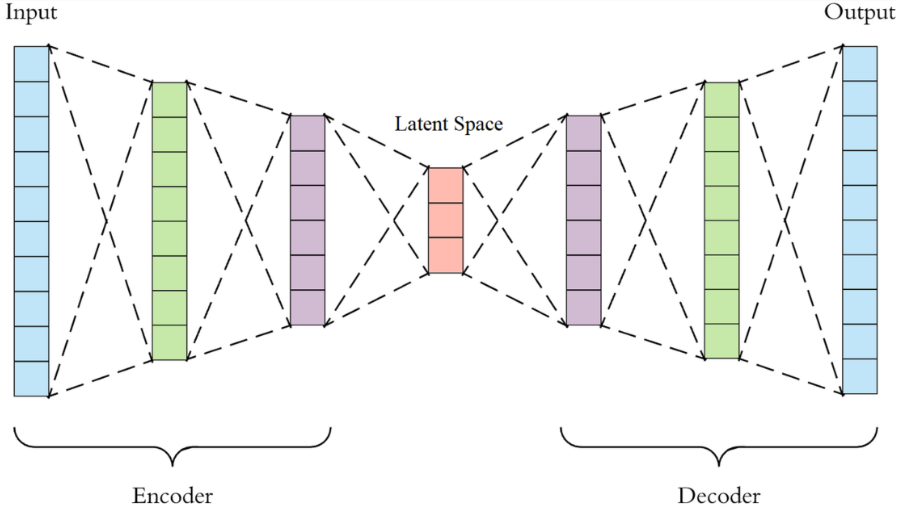
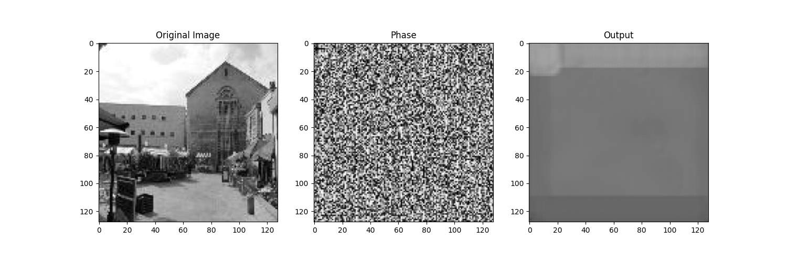
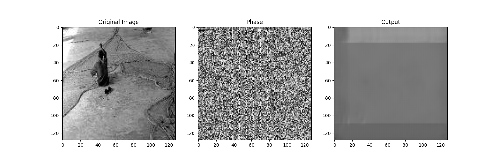
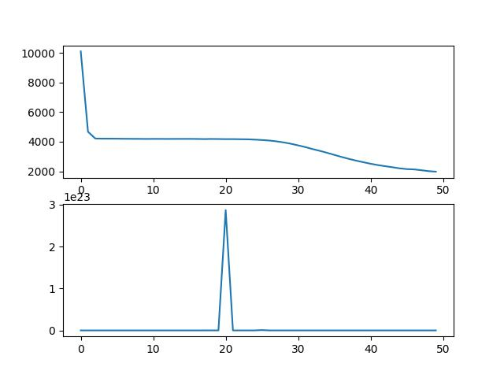

1. Neural Network Description
For our work we used the Autoencoder neural network architecture. We implemented it in PyTorch. The autoencoder consists of an encoder and a decoder where the encoder compresses the input data into a latent-space representation, while the decoder reconstructs the original input from this representation.

1.1. Encoder

The encoder takes an input image and processes it through a series of convolutional layers. These layers extract features from the input image. Each convolutional layer is followed by a rectified linear unit (ReLU) activation function, which introduces non-linearity. Batch normalization is applied after each ReLU activation, helping in faster convergence during training and improving the generalization of the model. Max-pooling layers are used to downsample the feature maps, reducing their spatial dimensions and capturing important information. The final output of the encoder is a compressed representation (latent space) of the input image.

1.2. Decoder

The decoder takes the compressed representation produced by the encoder and reconstructs the original input image. It uses transposed convolutional layers (also known as deconvolution or fractionally strided convolution) to upsample the feature maps back to the original input dimensions. Similar to the encoder, each transposed convolutional layer is followed by a ReLU activation function and batch normalization. The final output of the decoder is the reconstructed image.

2. Results

We trained our model for 50 epochs on a training dataset consisting of 4500 images and was tested on 500 images. We experimented with 4 values of learning rates: 0.01, 0.001, 0.0001, 0.00001. The best results were obtained for 0.01 learning rate value where the MSE value was equal to 4133. The outputs are not satisfactory because the images are not properly recovered from their spectra.

| LR    | 0.01 | 0.001 | 0.0001 | 0.00001 |
|-------|-----|--------|--------|---------|
| MSE   | 4081| 8989   | 19095  | 35415   |

