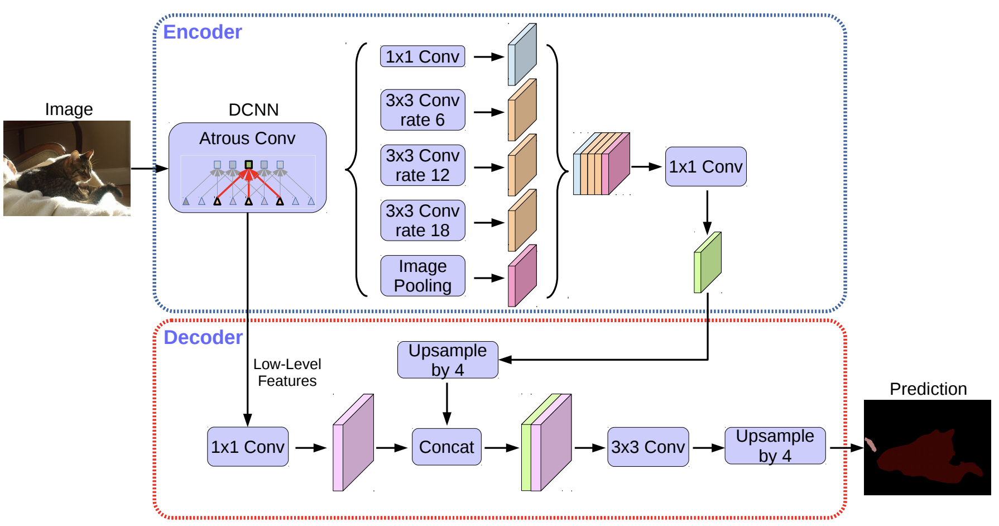
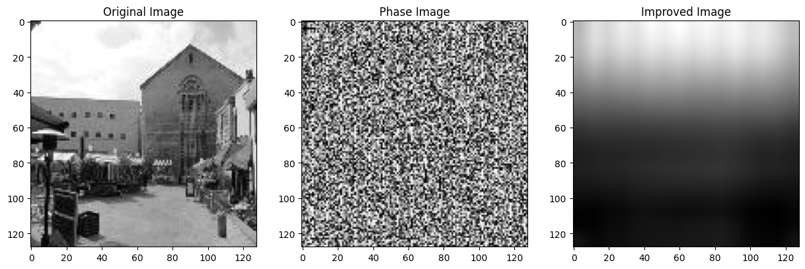
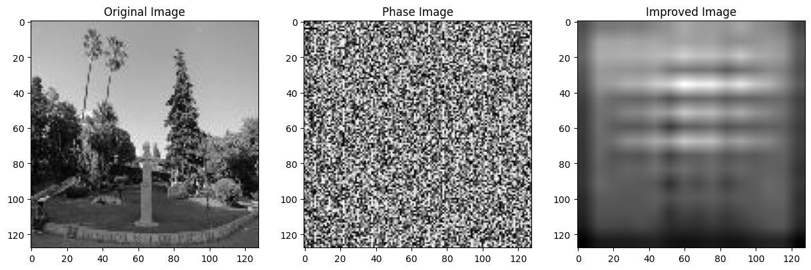
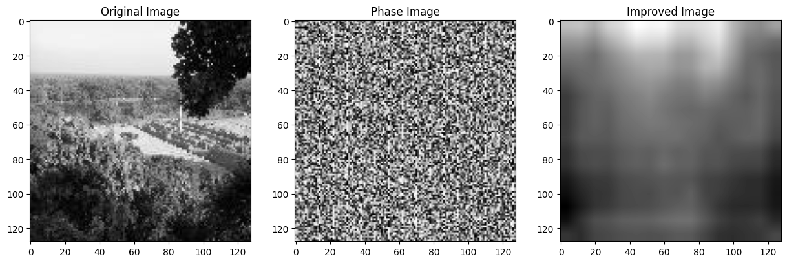
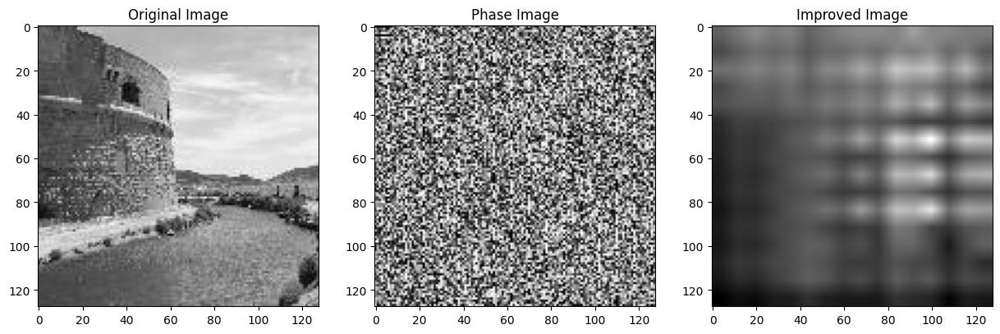

1. Neural Network Description
DeepLabV3Plus is a state-of-the-art, deep learning model for semantic image segmentation, where the goal is to assign semantic labels (e.g., car, dog, cat) to every pixel in the input image. It's an extension of the DeepLabV3 model and was introduced to improve segmentation performance by employing an encoder-decoder structure.

The main components of DeepLabV3Plus are:

Encoder (DeepLabV3): The encoder extracts the features from the input image. It uses an atrous convolution (also known as dilated convolution) to explicitly control the resolution at which feature responses are computed within Deep Convolutional Neural Networks. It also includes atrous spatial pyramid pooling (ASPP) to robustly segment objects at multiple scales.

Decoder: The decoder refines the segmentation results along object boundaries. It uses a simple yet effective decoder module to recover the object boundaries that are lost during downsampling.

Backbone: The backbone is the pre-trained model used for feature extraction. In our case ResNet50 is used as the backbone.

In our project the DeepLabV3Plus model is used for image recovery. The model is trained to map phase images to grayscale images. The model is trained using the Mean Squared Error (MSE) loss and the Adam optimizer. The trained model is then used to reconstruct images from the test dataset.

2. Results

The model was trained using 4500 images and tested on the remaining 500 images. We have performed 3 main tests. In the first two, we have used 10 epochs, 16 as the batch size and 0.001 learning rate. Because the GPU that was used is already 7 years old, the training took almost an hour. For that reason our tests were limited. One result of the average loss was equal 0.06587159831542522. The second result of the next test was equal 0.3688501351280138.
For the third test, we have changed the parameter values a bit - we have used 20 epochs, 16 as the batch size and 0.005 learning rate. The resulting average loss was the lowest from all three tests - equal to 0.05864615342579782.
The additional metric MSE was calculated to compare results from other groups and was equal to 17578.58644104004.

It can be said that even though the recovered outputs differ from one another, they are not satisfactory because the images are not properly recovered from their spectra.

@INPROCEEDINGS{9927609,
  title={Improved DeepLabV3+ image Semantic Segmentation Algorithm}, 
  author={Song, Yuzhe and Zheng, Guanghai and Zhang, Xin},
  booktitle={2022 IEEE 5th International Conference on Information Systems and Computer Aided Education (ICISCAE)}, 
  year={2022},
  pages={771-778},
  keywords={Technological innovation;Convolution;Computational modeling;Semantics;Data models;Decoding;Complexity theory;image semantic segmentation;DeepLabV3+ network model;ASPP;Channel attention;focal loss},
  doi={10.1109/ICISCAE55891.2022.9927609}}