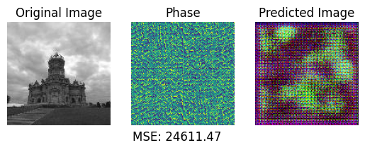
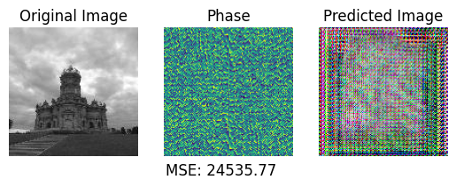
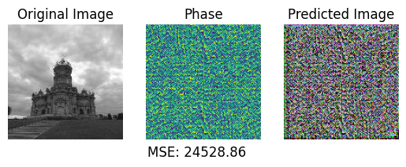

# CycleGAN
## Model description
CycleGAN is a type of deep learning model used for image-to-image translation tasks without paired training data. It belongs to the family of Generative Adversarial Networks (GANs) and was introduced in 2020 \cite{bib:b3}. Unlike traditional GANs that require paired images from different domains for training, this architecture can learn to translate images between two domains using unpaired datasets. This is achieved through a cycle-consistent training strategy, where the model learns to translate images from one domain to another and then back to the original domain, while ensuring that the reconstructed image closely resembles the original input. The key components include two generator networks and two discriminator networks. The generators are responsible for translating images between the two domains, while the discriminators aim to distinguish between real and translated images. Additionally, it introduces cycle-consistency loss, which penalizes the discrepancy between the original image and its reconstruction after being translated and then translated back. CycleGAN has various applications in image style transfer, domain adaptation, and image synthesis. For example, it can be used to convert images between different artistic styles, such as turning photographs into paintings, or to adapt images from one domain to another, such as converting satellite images to maps. Additionally, it has been employed in tasks like image colorization, object transfiguration, and even generating realistic images from sketches.  
  
@Misc{bib:b3,  
Title = {Unpaired Image-to-Image Translation using Cycle-Consistent Adversarial Networks},  
Author = {J. Y. Zhu and T. Park and P. Isola and A. A. Efros},  
Year = {2020},  
Eprint = {1703.10593},  
ArchivePrefix = {arXiv},  
PrimaryClass = {cs.CV}  
}  
  
## Results
The examination of CycleGAN architecture for image reconstruction from phase spectra has highlighted notable computational challenges and constraints. Researchers pursued the training of three distinct models with varying sample sizes and epochs to assess the applicability of CycleGAN in this context. However, the computational demands inherent to CycleGAN posed significant obstacles, hindering the ability to conduct training on the entire dataset. Estimations indicate that training CycleGAN on the complete dataset comprising 4500 samples with 50 epochs would necessitate approximately four days of computational resources. To address these limitations, researchers conducted experiments utilizing reduced training sets, as outlined in the provided table, detailing sample sizes, corresponding epochs, and resulting average Mean Squared Error (MSE) calculated over 500 samples.  
  
| Samples | Epochs | avg MSE |
|---------|--------|---------|
| 5       | 5      | 18575   |
| 50      | 10     | 18509   |
| 200     | 50     | 18506   |
  
Accompanying visualizations of the output generated by each model further underscore the challenges encountered with CycleGAN in reproducing faithful images.  
  
  
  
  
The discernible disparity between the generated images and their corresponding originals, as evidenced by both visual representations and quantitative MSE measurements, highlights the current limitations of utilizing CycleGAN for image reconstruction from phase spectra. Despite attempts to optimize training parameters and sample sizes, the resulting images exhibit significant deviation from the ground truth. Consequently, while CycleGAN shows promise in various image translation tasks, its efficacy for this specific application remains uncertain and necessitates further investigation by researchers.
